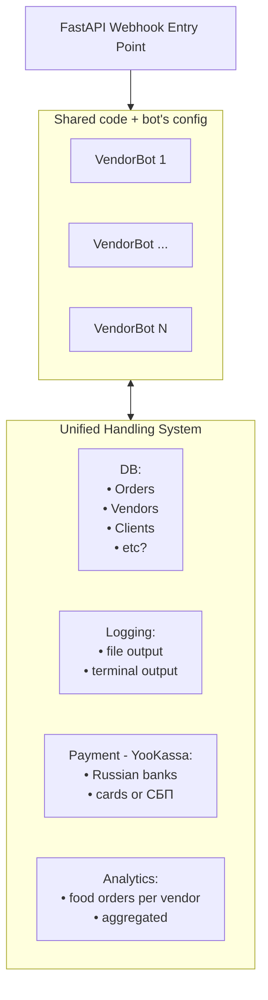

# Components

```mermaid
flowchart TD
    Entry[FastAPI Webhook Entry Point]

    subgraph VendorBots["Shared code + bot's config"]
        B1[VendorBot 1]
        B2[VendorBot ...]
        B3[VendorBot N]
    end

    subgraph UnifiedHandlingSystem["Unified Handling System"]
        DB[DB:
        • Orders
        • Vendors
        • Clients
        • etc?]

        LOG[Logging:
        • file output
        • terminal output]

        PAY[Payment - YooKassa:
        • Russian banks
        • cards or СБП]

        ANALYTICS[Analytics:
        • food orders per vendor
        • aggregated]
    end

    Entry --> VendorBots

    VendorBots <--> UnifiedHandlingSystem
```
